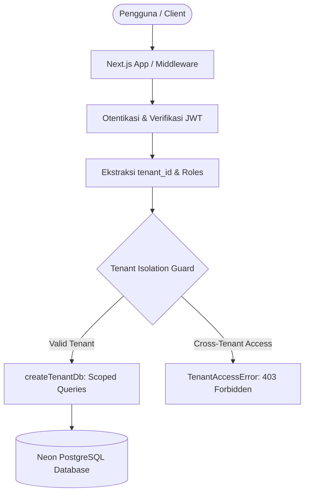

# SantriOS — Architecture Guide

Dokumen ini mendokumentasikan prinsip arsitektur sistem SantriOS sesuai dengan arahan `MASTER PROMPT — SANTRIOS.md`.

---

## 1. Prinsip Utama

1. **Multi-Tenant First**:
   SantriOS adalah sistem SaaS multi-tenant dengan model **Shared Database + Shared Schema + `tenant_id`**. Seluruh data bisnis pesantren harus mengikat ke `tenant_id`.

2. **Isolasi di Application / Service Layer**:
   Jangan mengandalkan developer untuk mengingat penambahan `where: { tenantId }` secara manual. Gunakan wrapper:
   ```ts
   const tenantDb = createTenantDb(tenantId);
   ```

3. **Layered Architecture**:
   ```text
   UI (Next.js Server / Client Components)
      ↓
   Server Action / API Route
      ↓
   Service Layer (Domain logic & validation)
      ↓
   Repository / tenantDb (Tenant-scoped queries)
      ↓
   Prisma Client
      ↓
   Neon PostgreSQL
   ```
   Dilarang keras meletakkan raw database queries atau direct Prisma calls langsung di dalam komponen UI.

4. **Modular SaaS & Feature Flags**:
   Sistem terdiri dari 13 modul independen. Kemampuan tenant mengakses data atau fitur modul diatur oleh relasi `TenantModule` dan divalidasi dengan `hasModule()` / `assertModuleEnabled()`.

5. **RBAC & Granular Permissions**:
   Akses operasi ditentukan oleh permission key (contoh: `students.create`, `finance.approve`), bukan sekadar nama role. Super Admin SaaS terpisah dari admin pesantren.

---

## 2. Diagram Multi-Tenancy



---

## 3. Komponen Monorepo

| Package | Tanggung Jawab |
|---|---|
| `apps/web` | Aplikasi web Next.js App Router, layout responsif (mobile & desktop), routing, Server Actions, dan API routes. |
| `packages/ui` | Komponen visual design system (Tailwind CSS, Lucide icons, mobile bottom bar, stat cards, empty states). |
| `packages/database` | Skema Prisma multi-tenant, centralized client singleton, tenant repository wrapper, seed data, pengujian isolasi. |
| `packages/auth` | JWT session generation, password hashing, pengecekan RBAC (`hasRole`, `hasPermission`, `isSuperAdmin`). |
| `packages/modules` | Registry 13 modul, pengecekan feature flags per tenant, error `ModuleDisabledError`. |
| `packages/types` | TypeScript interfaces dan types terpusat untuk seluruh aplikasi. |
| `packages/validators` | Skema validasi Zod untuk seluruh input form dan payload API. |
| `packages/utils` | Utilitas styling `cn`, formatter Rupiah Indonesia, helper tanggal, dan hirarki kelas error. |
